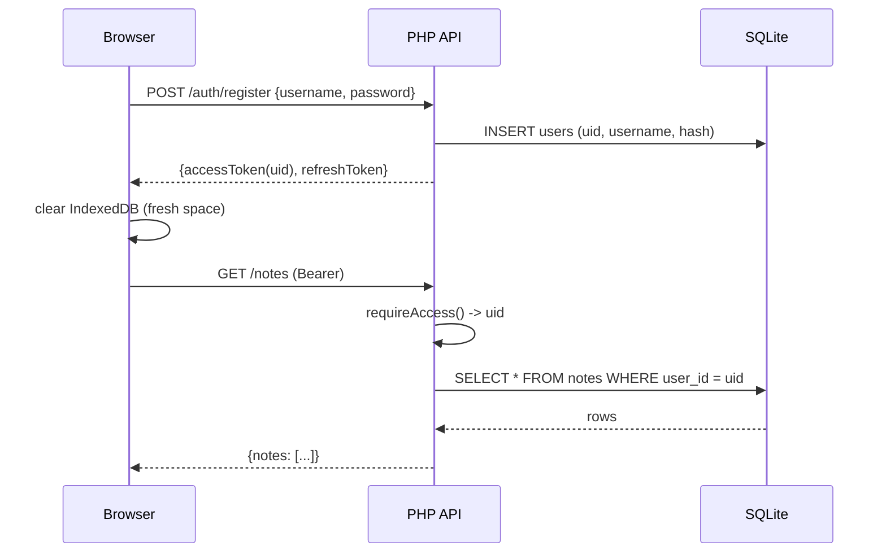

## 范围与非目标

- **做：** 多用户、开放注册（IP 速率限制）、所有读写按 `user_id` 隔离、JWT 携带 `uid`、前端注册页、登入/登出时清空本地 IndexedDB、`jwt_secret` 自动生成。
- **做：账号设置页**：改密码（要旧密码） + 活跃会话列表（看到自己在哪些设备/IP/UA 登录过、可以单独注销或一键全部注销） + 最近 30 天登录历史（成功 + 失败，用来发现"被偷窥"）。
- **不做：** 邮箱验证、邮箱密码找回、admin 后台、CAPTCHA、把 uploads 改成"鉴权代理下载"（继续靠不可猜测的文件名 + 加 user_id 子目录就够）。
- **不做：** 笔记里贴图片、单笔记 .md 导入导出、FTS5 全文搜索、代码块语法高亮——这些另开 plan。
- **`data/app.db` wipe fresh：** 不写迁移，直接 drop 所有表重建（用户已确认）。

## 关键设计决定

- **不自动登入老 jian 用户**：从 `config/config.php` 删 `username` 和 `password_hash`，第一次启动建空的 `users` 表，谁先注册谁就是普通用户（无 admin 概念）。
- **JWT `sub` 改成 user id**（之前是常量 `'owner'`）。`Auth::requireAccess()` 返回的 payload 里包含 `uid`，控制器用它做过滤。
- **服务器端永远忽略客户端的 `user_id`**：每条 INSERT/UPDATE/DELETE 都强制写当前 token 的 uid，sync push 也一样——客户端发什么 user_id 我都覆盖掉。
- **JWT secret 自动生成**：`bootstrap.php` 启动时若 `config['jwt_secret']` 是占位符，则生成一次写到 `data/.jwt_secret`，后续从该文件读。`config.example.php` 删掉手动生成步骤。
- **本地 IndexedDB 清理**：在 `api.login()` 成功后、`api.logout()` 之前都清空 Dexie 库（含 `tasks` / `notes` / `meta`，特别是 `meta:lastSyncAt`），避免跨用户串数据。
- **uploads 加 user 前缀**：从 `/uploads/2026/05/<rand>.png` 改为 `/uploads/<uid>/2026/05/<rand>.png`，依旧靠 8 字节随机文件名 + `.htaccess` 禁 PHP 执行；不引入鉴权代理。
- **会话可观测性**：每个 refresh token 在签发时记录 `user_agent` / `ip` / `last_used_at`；后续每次成功 `refresh()` 顺手 UPDATE `last_used_at`；这样账号页能给用户看"这个会话最后一次活动是 X 分钟前，从 IP X、设备 Chrome on Windows"。
- **登录历史用 `auth_attempts`**：现有这张表会同时记 `login` 和 `register` 事件，扩展两列 `user_id`（成功登录后写）和 `user_agent`，就能给 `/auth/login-history` 提供"成功 + 失败"双视图。
- **改密码不退出当前会话**：用户改完密码留在原网页，但其它所有 refresh token 自动 revoke（防止有人偷了 token 还能滚续）。当前 refresh token 不动，UI 上提示一句"已强制其它设备重新登录"。

## 数据流（多用户）

## 文件改动清单

### 后端 schema / config
- [`database/schema.sql`](database/schema.sql) — 重写：
  - 新建 `users(id, username UNIQUE, password_hash, created_at, password_changed_at)`。
  - 给 `tasks` / `notes` / `attachments` 加 `user_id TEXT NOT NULL REFERENCES users(id)` + 复合索引 `(user_id, updated_at)`、`(user_id, deleted_at)` 等。
  - `refresh_tokens` 加 `user_id`、`user_agent`、`ip`、`last_used_at`，索引 `(user_id, expires_at)`。
  - `login_attempts` 改名 `auth_attempts`，加 `kind TEXT NOT NULL CHECK (kind IN ('login','register'))`、`user_id TEXT`（成功登录时写）、`user_agent TEXT`，索引 `(user_id, created_at DESC)`。
  - `settings` 保留（全局，代码未用，不动）。
- [`app/Db.php`](app/Db.php) — `ensureSchema()` 探测表名从 `tasks` 换成 `users`（避免在旧 schema 上重复 init）。
- [`config/config.example.php`](config/config.example.php) — 删 `username` / `password_hash`；`jwt_secret` 改默认 `'auto'`。
- [`app/Config.php`](app/Config.php) / [`app/bootstrap.php`](app/bootstrap.php) — 当 `jwt_secret === 'auto' || ''` 时读/写 `data/.jwt_secret`（不存在则 `bin2hex(random_bytes(64))` 创建）。

### 后端 auth
- [`app/Auth.php`](app/Auth.php) — 大改：
  - 新增 `register(username, password, ip, ua)`：开放注册，IP 维度速率限制（每分钟 ≤ 3 次，沿用 `auth_attempts` 表 `kind='register'`）；用户名校验 `^[a-zA-Z0-9_]{3,32}$`；密码 ≥ 8 字符；写 `users`；自动签 token；记录 `auth_attempts(kind='register', user_id, ip, ua, success=1)`。
  - `login()` 改为查 `users` 表（`SELECT id, password_hash`），保留 `auth_attempts kind='login'` 速率限制；成功时把 `user_id` + `user_agent` 写进 `auth_attempts`；失败时 `user_id` 留 NULL（避免被探测用户名是否存在）。
  - `issueTokens()` 接收 `uid`、`ua`、`ip`，写入 JWT `sub`、写 `refresh_tokens.user_id/user_agent/ip/last_used_at=now`；常量 `SUBJECT='owner'` 删除。
  - `refresh()` 成功时 `UPDATE refresh_tokens SET last_used_at = now WHERE jti = ?`。
  - `requireAccess()` 返回的 payload 里有 `sub=uid`；新增 `Auth::userId(): string` 帮助方法。
  - 新增 `changePassword(uid, oldPassword, newPassword, currentJti)`：验旧密码 → `password_hash` 更新 + `password_changed_at` 更新 → `UPDATE refresh_tokens SET revoked=1 WHERE user_id=:uid AND jti != :currentJti`。
  - 新增 `listSessions(uid)`：返回当前用户所有 `revoked=0 AND expires_at > now` 的 refresh tokens（jti、ua、ip、last_used_at、created_at、是否当前会话）。
  - 新增 `revokeSession(uid, jti)` / `revokeAllSessionsExceptCurrent(uid, jti)`。
  - 新增 `loginHistory(uid, limit=50)`：从 `auth_attempts` 拉最近 30 天的 `kind='login'` 记录（成功的按 user_id；失败的按 ip 范围匹配——MVP 阶段只拉 user_id 命中的成功记录，失败记录跳过，避免泄露"有人尝试我的用户名"给别的攻击者）。
- [`app/controllers/AuthController.php`](app/controllers/AuthController.php) — 新增 `register()` / `changePassword()` / `sessions()` / `revokeSession()` / `revokeAllSessions()` / `loginHistory()`；`login()`/`me()` 返回里加 `user.id` + `user.username`。
- [`public/api/index.php`](public/api/index.php) — 注册路由：
  - `POST /auth/register`（公开）
  - `PATCH /auth/password`（鉴权）
  - `GET /auth/sessions`（鉴权）
  - `DELETE /auth/sessions/{jti}`（鉴权）
  - `DELETE /auth/sessions`（鉴权，等价"全部登出"——保留当前会话以外）
  - `GET /auth/login-history`（鉴权）

### 后端 controllers（按 uid 过滤）
所有这些每条 SQL 都得加 `AND user_id = :uid`，INSERT 都得带 `user_id`：
- [`app/controllers/NoteController.php`](app/controllers/NoteController.php)
- [`app/controllers/TaskController.php`](app/controllers/TaskController.php)
- [`app/controllers/SyncController.php`](app/controllers/SyncController.php) — `pull` 加 `user_id` 过滤；`push` 强制覆盖客户端 `user_id` 字段。
- [`app/controllers/UploadController.php`](app/controllers/UploadController.php) — 路径加 `<uid>/` 前缀；`attachments` 写 `user_id`；下载 URL 同步包含。

### 前端
- 新建 `public/register.html` — 复制 `login.html` 结构，标题"创建账号"，调 `/auth/register`，成功后同 login 一样存 token，跳 `index.html`。
- [`public/login.html`](public/login.html) — 删掉"默认账户：jian / 123456"提示；底部加 `没有账号？<a href="register.html">注册</a>`。
- [`public/js/api.js`](public/js/api.js) — 新增 `api.register()`、`api.changePassword()`、`api.listSessions()`、`api.revokeSession(jti)`、`api.revokeAllSessions()`、`api.loginHistory()`；在 `login()` 成功后、`logout()` 中调用 `wipeLocalCache()`（清 Dexie + `meta` 中 `lastSyncAt`）。
- [`public/js/db-local.js`](public/js/db-local.js) — 暴露 `wipeAll()`（`db.tasks.clear() + db.notes.clear() + db.meta.clear()`）。
- [`public/index.html`](public/index.html) — 在侧边栏底部"退出登录"按钮**上方**加一个"账号设置"按钮 + 一个 view（`view==='account'`）：
  - **改密码** 区块：旧密码 + 新密码 + 确认新密码 + 提交按钮；提交成功提示"其它设备已强制下线"。
  - **活跃会话** 区块：列出每条 session（设备/浏览器从 UA 简单解析、IP、最后活动时间、"当前会话"徽标）；每条带"注销此设备"按钮，底部一个"注销所有其它设备"。
  - **登录历史** 区块：表格列出最近 30 天最多 50 条登录记录，列：时间、IP、设备、状态（成功/失败）。一段说明文字"如果你看到不认识的登录，立即去改密码并注销所有设备"。

### 文档 / memory
- [`README.md`](README.md) — 删"改密码"那节、`deploy/hash.php` 步骤；登录改成"前端注册账号"。`config/config.php` 仍要 copy 但不再要手填哈希。
- [`AGENTS.md`](AGENTS.md) — 更新 `Current state` / `Last change` / `Known pitfalls`（标注：JWT secret 现在在 `data/.jwt_secret`，uploads 路径含 uid，IndexedDB 名仍是 `reminder-note`，靠 wipe 隔离）。
- 写 `CHANGELOG/2026-05-08-XXXX-multi-user-registration.md`。

## 验证（成功标准）

1. `composer install && npm install && npm run build && php -S 127.0.0.1:8765 dev-router.php` 不需要任何手动 hash 步骤就能跑。
2. `data/app.db` 删掉重启，访问 `/login.html` → 点"注册" → 填 `alice / pwAlice123` → 自动跳 `index.html` 看到空列表。建一条 note `"alice's secret"`。
3. 登出，注册第二个用户 `bob / pwBob123`，登入后**只看到空列表**，没有 alice 的 note；新建 note `"bob's secret"`。
4. 用 alice token 直接 `curl /api/notes` 必须只看到 alice 的 note；带 alice token 调 `PATCH /api/notes/<bob_note_id>` 必须 404。
5. `php deploy/api-smoke.php http://127.0.0.1:8765` 仍然通过（脚本可能要小幅改动以先注册再 login，列在子任务里）。
6. 同一浏览器：alice 登出 → bob 登入，IndexedDB 中没有 alice 的残留（DevTools → Application → IndexedDB 验证）。
7. **账号页验证**：alice 在两个浏览器各登录一次 → 账号页"活跃会话" 看到 2 条；点其中一个"注销" → 那个浏览器下次请求 401 → 自动跳登录页。在账号页"登录历史"里能看见两次成功登录 + 时间 + IP + UA。
8. **改密码验证**：alice 在浏览器 A 改密码 → 浏览器 A 仍然在线（当前会话保留）；浏览器 B 下次请求 401 跳登录页；用旧密码再登录失败、用新密码登录成功；登录历史里有那次失败 + 那次成功。

## 风险与回滚

- 因为 wipe fresh，**老 jian 数据全部丢**——已经获你确认。
- `data/app.db` 删除即回滚（schema 自动 re-init）。
- `data/.jwt_secret` 删除即让所有现有 token 失效（前端会自动跳登录）。